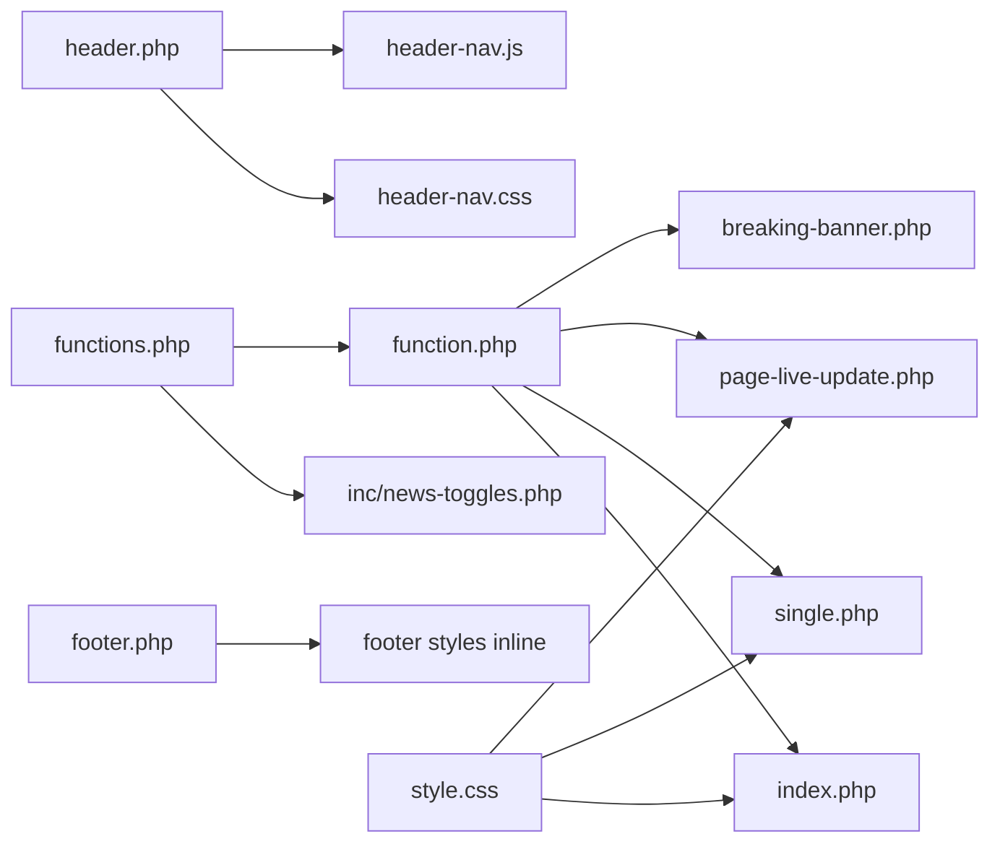

# 03 — Theme Architecture

ABC_NEWS is a classic WordPress theme with a small amount of feature modularization.

## High-level design

1. **Bootstrap layer** (`functions.php`) loads feature modules and registers hooks.
2. **Feature layer** (`function.php`, `inc/news-toggles.php`) owns all logic:
   - section configuration
   - rendering helpers
   - custom post types and taxonomies
   - AJAX handlers
   - enqueue rules
3. **Template layer** (`header.php`, `footer.php`, `index.php`, `single.php`, `page-*.php`)
   owns markup and the Loop.
4. **Asset layer** (`style.css`, `header-nav.css`, `header-nav.js`, `js/*.js`) owns presentation.

## Key architectural decisions

- **Single shared renderer.** Almost every section page calls `abcnepal_render_news_section($section)`.
  This keeps markup DRY and centralizes fallback behavior (placeholder images, fallback headlines).
- **Section config as code.** `abcnepal_section_config()` returns a static associative array
  keyed by section slug. This is effectively a lightweight content-type configuration.
- **Toggle-driven editorial flags.** Breaking / Featured / Hero are stored as post meta and surfaced
  through `inc/news-toggles.php`. This avoids needing a separate plugin.
- **Custom post type for live updates.** `live_update` is separate from `post` so live entries can
  be queried, polled, and archived independently.
- **Two navigation stacks co-exist.** The older checkbox/CSS toggle (`.nav-toggle`, `.hamburger`)
  is still present in `style.css` but hidden; the modern JS-driven drawer (`header-nav.css`,
  `header-nav.js`) is the active one.

## Data flow (section page)

```
URL -> WP rewrite
  -> page template (e.g. english.php)
    -> get_header()
    -> abcnepal_render_news_section('english')
      -> abcnepal_section_config('english')
      -> WP_Query (category_name = english)
      -> outputs breaking banner, hero, sidebar list, card grid, ad slot
    -> get_footer()
```

## Data flow (single post)

```
URL -> single.php
  -> get_header()
  -> sp-ticker (latest post from same category)
  -> Loop
    -> category tag, title, meta, featured image, the_content()
    -> share bar (FB, Twitter, WhatsApp, Viber)
    -> related posts (same category)
  -> sidebar: latest 10 posts in same category + ad slot placeholder
  -> get_footer()
```

## Data flow (live update page)

```
URL -> page-live-update.php
  -> get_header()
  -> abcnepal_render_news_section('Live-blog')
  -> initial WP_Query for live_update (30 most recent)
  -> <meta id="live-last-id"> for JS
  -> get_footer()
  -> live-updates.js polls GET admin-ajax.php?action=get_live_updates&last_id=...
     NOTE: server handler for get_live_updates is not present in this snapshot;
           only load_more_updates is implemented in function.php.
```

## Component relationships



## Risks / technical debt

- `function.php` and `functions.php` both exist and both define similar functions; this is confusing.
- `register_live_update_cpt()` is defined twice in `function.php` (lines 536 and 644).
- `page-province.php` and `page-sahitaya.php` are near-identical copies.
- `footer.css` is empty; footer styles are inlined in `footer.php`.
- `single-live-blog.php` mixes PHP and HTML in an order that produces output before `get_header()`.
- `js/live-updates.js` calls an AJAX action `get_live_updates` that is not implemented in PHP.
