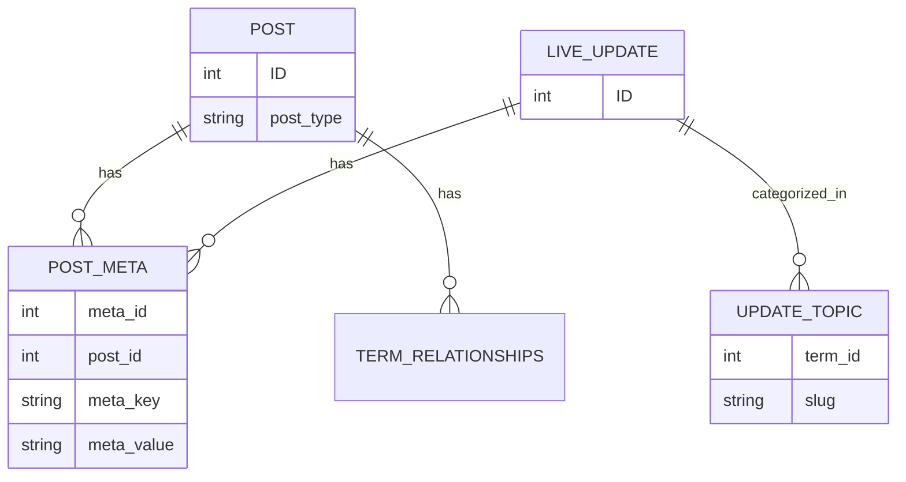

# 11 — Database

ABC_NEWS uses standard WordPress tables and adds a small amount of custom metadata through post meta and a custom taxonomy.

## Custom tables

None. All data stored through WordPress APIs.

## Custom post types

| CPT slug     | Purpose                                |
|--------------|----------------------------------------|
| `live_update`| Live-blog entries attached to a story. |

`supports`: title, editor, thumbnail, author. Public, has archive, show_in_rest.

## Custom taxonomies

| Taxonomy      | Object type   | Slug           |
|---------------|---------------|----------------|
| `update_topic`| `live_update` | `update_topic` |

Hierarchical. Public. Admin column enabled.

## Post meta keys

| Key                  | Owner | Purpose                                                |
|----------------------|-------|--------------------------------------------------------|
| `_abcnt_breaking`    | post  | Mark up to 5 active breaking posts (value `1`).        |
| `_abcnt_featured`    | post  | Mark featured posts (value `1`).                       |
| `_abcnt_homepage_hero` | post | Pin exactly one post as hero (value `1`).            |

## Options / theme mods

| Mod/settings        | Purpose                                             |
|---------------------|-----------------------------------------------------|
| `custom_logo`       | Site logo URL override.                             |

No custom options are registered directly by this theme beyond `title-tag` and `post-thumbnails` support.

## Data relationships

## Query patterns

- Category queries use `category_name` (slug) rather than `cat` (ID).
- Breaking/featured/hero posts use `meta_key` + `meta_value` queries.
- Live update polling tracks newest ID via `<meta id="live-last-id">`.
